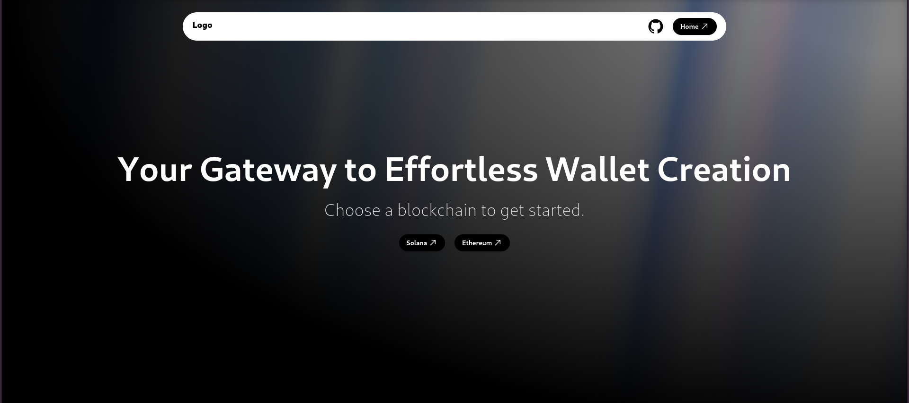

# Wallet Generator

## Overview

The Wallet Generator is a web application that allows users to create and manage cryptocurrency wallets for multiple blockchains, including Solana and Ethereum. Users can generate wallets using a mnemonic phrase, view their public and private keys, and securely store this information in their browser's local storage.

  <!-- Replace with your image path -->

## Features

- Generate wallets for Solana and Ethereum using BIP39 mnemonic phrases.
- View and manage multiple wallets.
- Copy public and private keys to the clipboard.
- Clear all wallets and keys securely.
- Responsive UI with a clean design.

## Technologies Used

- **React**: A JavaScript library for building user interfaces.
- **TypeScript**: A typed superset of JavaScript that compiles to plain JavaScript.
- **Framer Motion**: A library for animations in React applications.
- **Lucide React**: An icon library for React.
- **BIP39**: A library for generating and validating mnemonic phrases.
- **TweetNaCl**: A cryptographic library for generating key pairs.
- **ethers.js**: A library for interacting with the Ethereum blockchain.

## Installation

1. Clone the repository:

   ```bash
   git clone https://github.com/yourusername/wallet-generator.git
